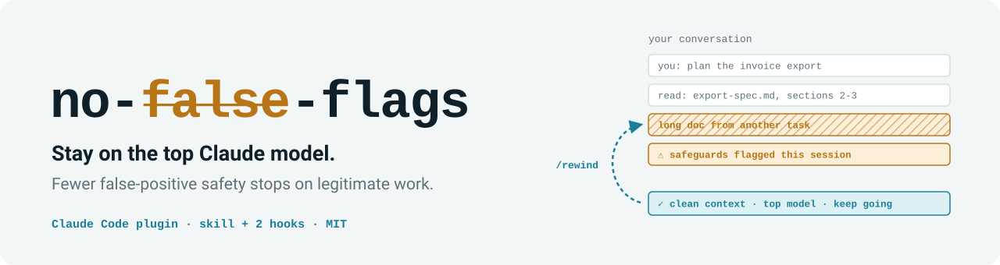
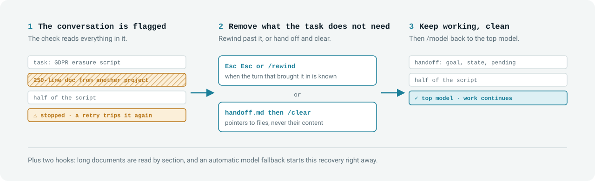
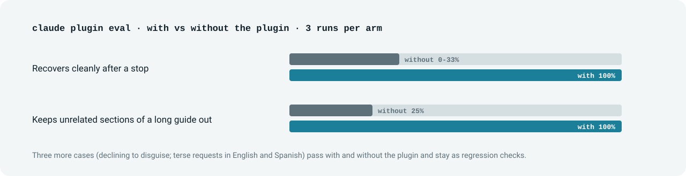

<p align="center">
  <picture>
    <source media="(prefers-color-scheme: dark)" srcset="assets/banner-dark.svg">
    
  </picture>
</p>

<p align="center">
  <a href="LICENSE"></a>
  <a href="https://code.claude.com/docs/en/plugins"></a>
  <a href="#results"></a>
</p>

You are doing ordinary, legitimate work on a top Claude model (Fable 5.1, Fable 5,
Opus 5.5, Opus 5), and a safety check stops you. You retry, and it stops you again. Soon you are on a lower model for the
rest of the day.

**no-false-flags** is a Claude Code plugin that changes how Claude runs the working
conversation, so legitimate work reads as what it is and stops getting cut. It
works in any language you talk to Claude in.

## Quick start

```
/plugin marketplace add https://github.com/WillyAR68/no-false-flags.git
/plugin install no-false-flags@willyar68
```

That's it. It installs for your user, in every project, and works on its own.

## The problem

```
<model>'s safeguards flagged this session. ... <fallback model> is answering instead.
```

```
Your response above was stopped by a safety classifier — this is not a tool or
API error. The rest of it was withheld.
```

It happens on every model that runs safety classifiers. The Claude Code docs list
Fable 5.1, Fable 5, Opus 5.5 and Opus 5. A flagged request is re-run on a fallback
model: cybersecurity flags drop you to **Opus 4.8**, and
biology flags to Opus 5. The docs also explain why a retry rarely helps:

- The check **evaluates the full conversation, not only your latest prompt**. A new
  message in the same session usually re-triggers it, and so does reopening it with
  `--continue` or `--resume`. ([errors](https://code.claude.com/docs/en/errors))
- The **first request of a session carries your CLAUDE.md and git status**, so
  workspace context alone can trip it. ([model config](https://code.claude.com/docs/en/model-config))

So the cause is usually not your request. It is **what else is sitting in the
conversation**: a long document read whole, material from an earlier task, a heavy
always-loaded rules file. Rewording does not remove it. Taking it out does.

## How it works

<p align="center">
  <picture>
    <source media="(prefers-color-scheme: dark)" srcset="assets/how-it-works-dark.svg">
    
  </picture>
</p>

One skill and two small hooks:

| When | What happens |
|---|---|
| **A response gets stopped** | Claude stops working in the flagged conversation and names the unneeded file, never its content. Then it gets you out cleanly: `/rewind` to before the turn that brought it in, or a pointer-only handoff and `/clear`, then `/model` back. |
| **The model falls back on its own** | A `PostModelSwitch` hook tells Claude to start that recovery right away instead of carrying on. |
| **A long document is about to be read whole** | A `PreToolUse` hook stops the whole-file read of long `.md`, `.txt`, `.rst` and `.adoc` files. Claude greps the headings and reads only the sections the task needs. |
| **You ask it to "just disguise it"** | It refuses to reword or obfuscate, and gives you the legitimate way forward. |
| **A terse request touches a sensitive domain** | It restates it as one line you can confirm: action, data, purpose (asked, not assumed), safeguards. |

**An already flagged conversation cannot be cleaned from the inside.** That is why
the plugin's job there is to move you out of it quickly and cleanly.

## Results

<p align="center">
  <picture>
    <source media="(prefers-color-scheme: dark)" srcset="assets/results-dark.svg">
    
  </picture>
</p>

Built test-first. The scenarios ship as a
[Claude Code eval suite](https://code.claude.com/docs/en/plugin-evals) that runs
each case with and without the plugin, 3 runs per arm:

| Case | Without | With |
|---|---|---|
| `recovers-after-stop` | 0% to 33% | **100%** |
| `reads-long-guide-by-section` | 25% | **100%** |
| `declines-disguising` | 100% | 100% |
| `restates-terse-request` | 100% | 100% |
| `restates-terse-request-es` (Spanish) | 100% | 100% |

The last three already pass without the plugin in a clean eval session and stay as
regression checks. The fallback hook is unit-tested; an eval cannot trigger a real
safety fallback. Run the suite yourself:

```
claude plugin eval . --trust-plugin --scaffold
```

`--scaffold` runs one small script that creates the neutral guide used by the
guide case. Eval runs use your own Claude credentials and plan.

### In real use

A VS Code session on Opus 5.5 kept getting flagged and fell back to Opus 4.8. With the plugin,
Claude wrote a pointer-only handoff, the session was cleared, the handoff was loaded
on Opus 5.5, and the work continued with no further flags. The session was in
Spanish. One case, not a benchmark.

## Cost and settings

- **Tokens:** about 110 per session (the skill's short description). The skill body,
  about 1.1k tokens, loads only when it is used. The hooks add nothing to the
  context unless they act.
- **Requirements:** the hooks need `bash` (macOS, Linux, or Git Bash on Windows).
- `NO_FALSE_FLAGS_MAX_LINES` (default `150`): a document longer than this is read by
  section.
- `NO_FALSE_FLAGS_READ_GUARD=0`: turn the read hook off.
- Invoke the skill by hand with `/no-false-flags:no-false-flags`.
- Update with `/plugin marketplace update willyar68`.

## What it is not

- **It does not disable, bypass, or deceive any safety check.** Checks run
  server-side, outside any prompt. The skill refuses to reword or obfuscate content
  to get past a check.
- **It does not guarantee zero stops.** The realistic result is far fewer false
  positives on legitimate work.

## FAQ

**Is this a jailbreak?**
No. It takes unrelated material out of the conversation and states legitimate work
precisely. If a request is not legitimate, nothing here helps it, by design.

**Does it work in my language?**
Yes. The skill is written in English and Claude applies it in whatever language you
use. The eval suite includes a Spanish case.

**I do legitimate security work and get flagged constantly.**
Apply to Anthropic's [Cyber Verification Program](https://support.claude.com/en/articles/14604842-real-time-cyber-safeguards-on-claude).
That is the official route for that case.

**I got flagged anyway in a clean session.**
Report it with `/feedback`. That is how the checks get tuned.

**Which models?**
All of them. The docs list safety classifiers on Fable 5.1, Fable 5, Opus 5.5 and
Opus 5. Nothing in the plugin depends on a specific model.

## Repository layout

```
.claude-plugin/          marketplace.json and plugin.json
hooks/                   read-by-section and after-fallback hooks
skills/no-false-flags/
    SKILL.md             the skill
    references/          on-demand detail: layers, audit, demotion, intent, limits
    examples/            a checklist and a worked before/after case
evals/                   with-vs-without eval suite
assets/                  README images
```

## Contributing

Issues and pull requests are welcome, especially real cases (sanitized) where the
plugin helped or did not. See [CONTRIBUTING.md](CONTRIBUTING.md).

## License

MIT. See [LICENSE](LICENSE).
